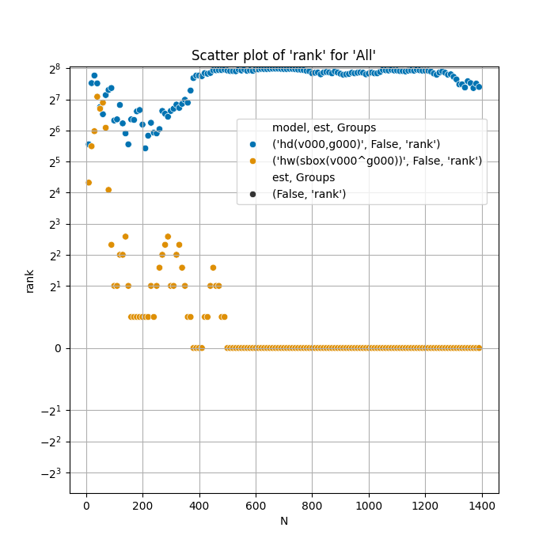
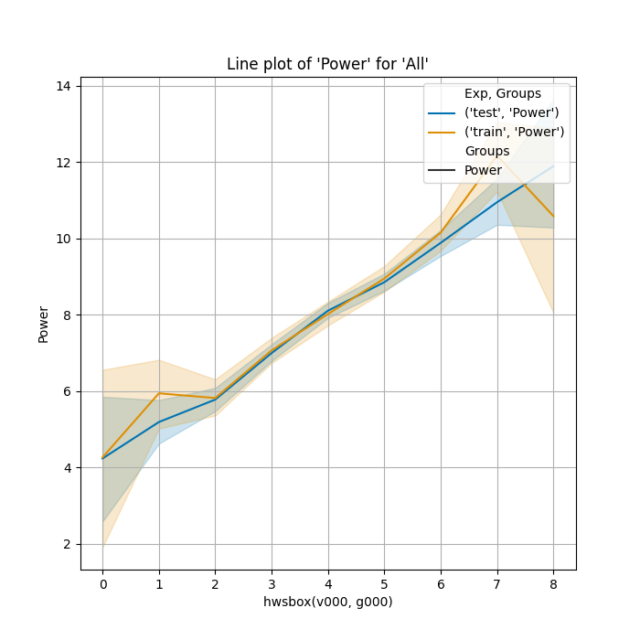

# Rapid Data Analysis (RDA)

**Rapid Data Analysis (RDA)** is a versatile framework designed to facilitate the analysis of experimental data. It provides built-in functions, intuitive plotting capabilities, and advanced tools for statistical and power analysis. RDA is ideal for quickly exploring your data after experiments, and it also supports custom power models and Correlation Power Analysis (CPA) attacks.

RDA uses the Pandas, Numpy, Seaborn, Scipy and many more packages for easy data visualization and includes optimized GPU implementations for large-scale CPA attacks, ensuring high performance even with extensive datasets.

## Key Features

- Simple and efficient plotting functions for rapid data visualization.
- Support for statistical outlier removal through a pipeline-based approach.
- Both generic and GPU-accelerated CPA implementations for power analysis and CPA attacks.
- Customizable power models for detailed, flexible analysis.

## CPA Support

RDA offers two variants of Correlation Power Analysis (CPA):

1. **CPU-based Generic CPA**  
   This variant allows for arbitrary, user-defined models and runs on the CPU. While highly flexible, it is constrained by the number of samples and model complexity, making it ideal for smaller datasets or simpler analyses.

2. **GPU-accelerated CPA**  
   This variant is a highly optimized CPA implementation using the CuPy library, requiring an NVIDIA GPU with CUDA support. It supports predefined models such as Hamming Distance, Hamming Weight, and Hamming Weight of S-box outputs, which can be combined to create complex models. With GPU acceleration, RDA efficiently processes large datasets:
   - 48-bit data with 50 million samples can be analyzed in about 3 hours.
   - 40-bit data with 50 million samples takes around 1 minute.

## Installation

To avoid package conflicts, it is recommended to use a virtual environment, such as `venv`.

### Installation Steps:
1. Install the required dependencies:
   ```bash
   pip install -r requirements.txt
   ```

2. Install RDA in editable mode:
   ```bash
   pip install -e .
   ```

## Usage Examples

### Example Dataset
Assume we are analyzing a cache hit/miss histogram saved in a NumPy `.npy` file, structured as follows:

| Timing | Label |
|--------|-------|
| 121    | Hit   |
| 312    | Miss  |
| 111    | Hit   |

Here, `Timing` represents the measured time, and `Label` indicates the outcome (Hit or Miss).

### Plot a Histogram

To generate a simple histogram:

```bash
rda - i file.npy - g Label - plot_hist Timing
```

This will create a histogram of the `Timing` data, grouped by the `Label` values.

### Remove Outliers

RDA follows a pipeline-based approach, where commands are executed sequentially.

#### Remove 1% of Outliers (Overall)
To remove 1% of all samples as outliers:

```bash
rda - i file.npy - per Timing 0.5 99.5 - g Label - plot_hist Timing
```

#### Remove Outliers by Class
To remove 1% of outliers for each class separately:

```bash
rda - i file.npy - g Label - per Timing 0.5 99.5 - plot_hist Timing
```

This approach removes 2% of the total samples but applies outlier handling differently for each class, which is essential when class distributions differ.

## Power Analysis

RDA also supports power analysis. In the following example we use the build in simulation facility to simulate a textbook CPA attack on an aes sbox. If there is a leakage between `Value` and `Guess`, the following command analyzes the relationship between the model and the provided data:

```bash
rda - power_sim_aes_sbox 1000 - power_init --no_diff - g Exp - power_models "hwsbox(v000, g000)" - power_fit Power - print
```

This will output results like the following:

```
> print_data n=None index=None
            rho     rho_l     rho_u    pv_rho  r2_score    N    type x y  hw(sbox(v000^g000))                model
Exp
test   0.104796  0.030934  0.177521  0.005514  0.010840  700  unknown                 1.131573  hw(sbox(v000^g000))
train  0.152331  0.039777  0.261069  0.008220  0.022043  300  unknown                 1.501876  hw(sbox(v000^g000))
```

### Explanation of Fields

| Field   | Description                                                                 |
|---------|-----------------------------------------------------------------------------|
| `rho`   | Pearson correlation coefficient of the model and data                       |
| `rho_l` | Lower bound of the Pearson correlation coefficient                          |
| `rho_u` | Upper bound of the Pearson correlation coefficient                          |
| `pv_rho`| p-value of the Pearson correlation coefficient estimate                     |
| `hw(sbox(v000^g000))` | Linear regression coefficient for the model component          |
| `r2_score` | R² score of the linear regression                                         |


### Performing a CPA Attack

To run a CPA attack where the secret `Value` is unknown (used only for ground truth validation):

```bash
rda - power_sim_aes_sbox 1000 - power_init --no_diff - g Exp - power_models "hwsbox(v000, g000)" "hd(v000,g000)" - pw_cpa Power --step 10
```

This command will run a CPA attack iteratively and plot the ranks of the correct key candidate. We see that the wrong Hamming distance model will not converge to the correct key candidate. 



### Visually Validating the Power Model

You can also plot the power model against the power consumption data to visually validate whether the model is influencing the power consumption:

```bash
rda - power_sim_aes_sbox 100000 - power_init --no_diff - power_eval_model "hwsbox(v000, g000)" - g Exp - idx "hwsbox(v000, g000)" - plot_line Power
```




# Disclaimer
This code is provided "as-is," without any warranties or guarantees regarding its correctness, performance, or suitability for any particular purpose. Use this code at your own risk. The authors and contributors are not responsible for any direct or indirect damages or issues that arise from the use of this code. No support or maintenance is implied.

# Acknowledgments
Special thanks to Gäetan Cassiers for the countless discussions on optimizing the performance of the CPA implementation.